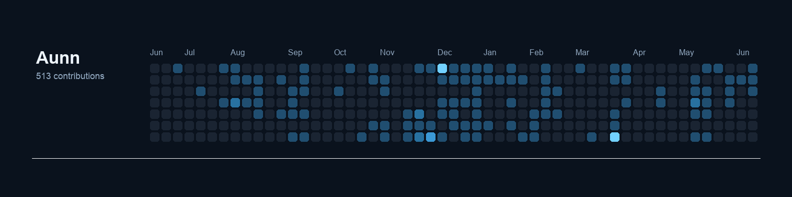

  

# Hey! I'm Sahil Chopra!

- I've been coding for 10 years, and my journey began with Python, which remains my favorite language.
- I love web development, automation, and anything Python-related.
- I love contributing to random repositories I find interesting!

## Want to Talk?

- Fastest response would be through discord, at "aunn.exe".
- I will also respond on email at choprasahil.sc@gmail.com!

## My Current Projects

- Homebase Chrome Extension
- Town of Salem Recreation
- Aboutlet
- My Chess AI
- Other miscellaneous projects
- Have an interesting project? Show me!

## GitHub Activity

  

  

  

  <a href="https://github.com/anuraghazra/github-readme-stats">Thanks!</a>

